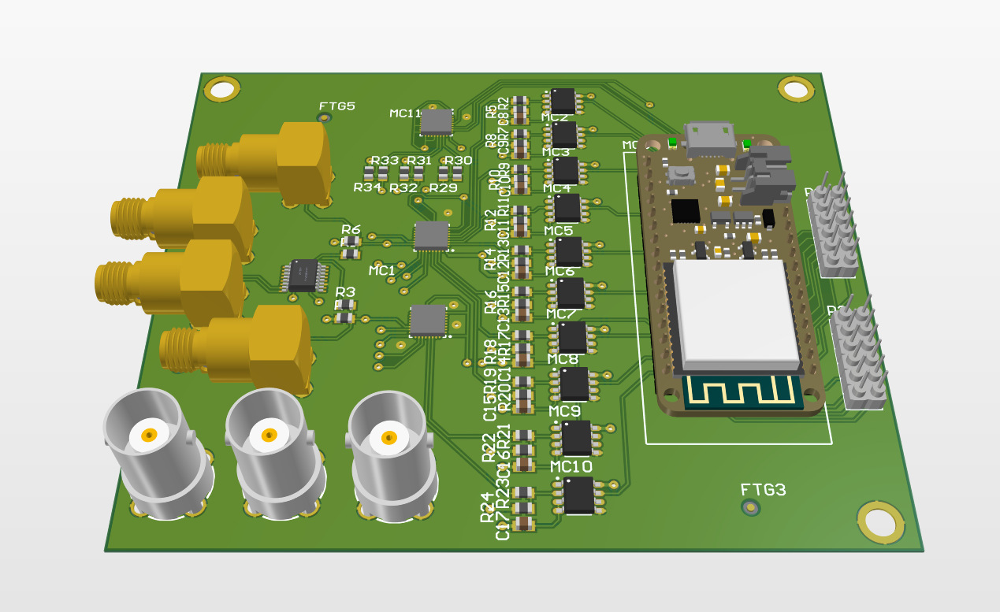
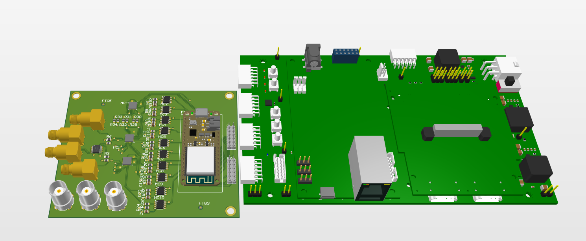

# Data Aqcuisition Circut of Diamond Beam Loss Monitor AC Spikes

It consists of some integrated components (ICs) and an **STM32 Feather MCU** and it is compatible also with the MicroZed FMC Carrier Card and we used the Xilinx ZYNQ XC7Z010 Board.

